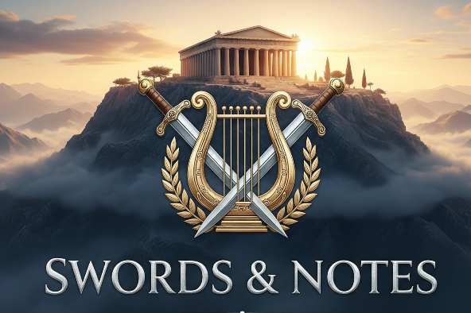

# Swords & Notes


[](https://unity.com)
[]()

**Swords & Notes** is an educational rhythm game designed to help players master musical notes using a real instrument. By implementing a custom signal processing engine, the game analyzes live audio input to detect pitch and amplitude in real-time, requiring players to play specific notes to deflect incoming attacks.

---

## 🎮 Gameplay Demo


* **Input:** Real-time audio.
* **Mechanic:** Enemies launch projectiles (swords) corresponding to specific musical notes.
* **Goal:** Identify and play the correct note on your instrument to shatter the sword before it strikes.
* **Progression:** Survive longer to unlock harder levels and cosmetic costumes, reinforcing note recognition through repetition.

---

## ⚙️ Technical Architecture

This project distinguishes itself by avoiding standard audio analysis APIs in favor of a **custom-built DSP pipeline** and a decoupled event-driven architecture.

### 🎧 Digital Signal Processing (DSP) Engine
The core of the game is a custom-written audio analysis engine (`SimpleFFT.cs` & `Listener.cs`) designed for low-latency instrument tracking.

* **Custom FFT Implementation:** A **Radix-2 Decimation-in-Time (DIT)** algorithm implemented from scratch using a custom `Complex` number struct, avoiding the overhead of external DSP libraries.
* **Spectral Leakage Control:** Applies a **Hanning Window** function to the PCM buffer before processing to minimize side-lobes and improve frequency isolation.
* **Sub-Bin Accuracy:** Standard FFT bins are often too wide for precise musical tuning. I implemented **Parabolic Interpolation** to estimate the true frequency peak between bins:
  $$
  \text{correction} = 0.5 \times \frac{\text{left} - \text{right}}{\text{left} - 2(\text{center}) + \text{right}}
  $$
  This allows for precise note detection (e.g., distinguishing A4 at 440Hz from A#4).
* **Harmonic Filtering:** To solve the "Octave Error" common in guitar detection (where the 2nd harmonic is louder than the fundamental), the engine uses a dynamic threshold (`harmonicThreshold`) to validate peaks against their neighbors.

### 🏗️ Software Design Patterns

* **ScriptableObject Event Architecture (Observer Pattern):** Game systems are fully decoupled using `GameEvent` assets. The `Listener` (Audio Engine) does not reference the `Spawner` directly; it simply raises an event. This allows for modular testing and easier expansion.

* **Object Pooling:** To maintain a steady 60+ FPS during rapid gameplay, a custom `Pool` system manages Sword and Note projectiles. This eliminates runtime instantiation and garbage collection spikes, which is critical for audio synchronization.

* **Bitwise Operations for State:** Musical data is handled using `[Flags] enum`, allowing efficient bitwise operations to handle Sharp/Flat modifiers alongside base notes (e.g., `NoteType.C4 | NoteType.Sharp`).

---

## 📂 Project Structure

The codebase is organized into modular domains to enforce separation of concerns:

```text
/Scripts
  /AudioAnalysis         # DSP Logic (FFT, Windowing, Pitch Detection)
    - SimpleFFT.cs
    - Listener.cs
    - NoteType.cs        # Bitwise Enum for musical notation
  /Core                  # Systems & Architecture (Generic utilities)
    - GameEvent.cs       # Observer Pattern Implementation
    - Pool.cs            # Memory Management System
    - Data.cs            # JSON/Prefs Persistence Layer
    - LevelManager.cs    # Progression Logic
  /Gameplay              # Specific Game Logic & Entities
    - Spawner.cs         # Rhythmic orchestration
    - Projectile.cs      # Combat physics and collision
    - King.cs            # Boss Pattern Logic
    - Knight.cs          # Enemy Pattern Logic
  /Player                # Player State Management
    - PlayerHealth.cs
    - PlayerCostume.cs
  /UI                    # User Interface & Frontend Logic
    - MainMenu.cs        # Menu navigation logic
    - Settings.cs        # Resolution & Volume management
    - Story.cs           # Narrative typewriter system
    - HealthUI.cs        # HUD updates
```

---

## 🛠️ Features & Systems

### **Persistence & Save System**
* **Level Locking:** A progression system managed by `LevelManager.cs` where completing levels unlocks subsequent challenges.
* **Unlockable Cosmetics:** High scores (based on survival time) unlock new costumes. This data is serialized via `PlayerPrefs` and checked dynamically at runtime.

### **UI & Polish**
* **Dynamic Resolution:** A complete Settings menu allows users to change resolution and fullscreen modes at runtime, populating options based on the user's hardware.
* **Narrative Engine:** A coroutine-based typewriter system (`Story.cs`) handles exposition with dynamic character alpha fading to indicate the active speaker.

---

## 🚀 Performance Optimization

Processing audio in real-time requires strict latency management.
* **Zero-Allocation:** The FFT loop is optimized to generate minimal garbage collection (GC) allocation per frame to prevent stutter.
* **Lookup Tables:** Pre-calculated Sine/Cosine tables are used for the twiddle factors in the FFT calculation.

---

## 🛠️ Installation & Setup

### Prerequisites
* **Hardware:** An instrument and a high-quality microphone.
* **OS:** Windows 10/11.
